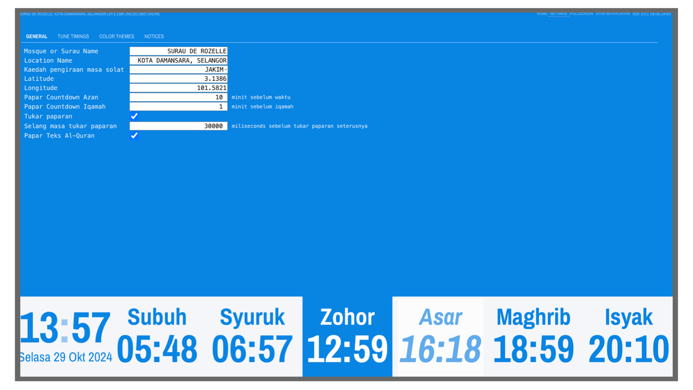
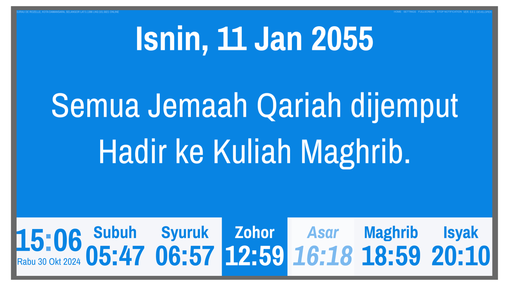

# Muslim Prayer Times

This is a simple web app that displays muslim prayer timings, next prayer time and countdown to Iqamah. The app is built using SolidJS and Vite. It is designed to be used on a 27 inch 4K TV that uses computer with an OS with Google Chrome installed.

## Screenshots

 
<em>Figure 1: Screenshot of the application's main screen.</em>

 
<em>Figure 2: Application's user settings screen.</em>

 
<em>Figure 3: Displays notice or event for mosque.</em>

 
<em>Figure 4: Displays daily hadith.</em>

## Development Status

This project is currently in active development. While core functionality is implemented, some features are still being added and refined. Contributions and feedback are welcome!

## Features

Currently the prayer names <i>(Subuh, Zohor, Asar, Maghrib aand Isyak)</i> are in Bahasa Malaysia.

- Display prayer times.
- Play adhan.
- Display hijri date.
- Display the next prayer time and countdown to Iqamah.
- Display daily Qur'an verse.
- Display daily Hadith randomly from 100 hadiths by Imam Bukhari, Sahih Bukhari (Vol.1).
- Display daily dua from Qur'an. Total forty Rabbana duas.
- Display notice (mosque annoucement).

## Usage

For now the application can be tested on MacOS. Installed [node](https://nodejs.org/en/download/package-manager) on your machine before proceed the steps below.
Google Chrome and Firefox internet browsers are used in the development.

1. Download or in a terminal git clone this directory. Then change into the `muslim-prayer-times` directory.
2. Then, run command `npm install`.
3. Then, run command `npm run dev`
4. Open `http://locahost:3000` in the web browser.
5. You might want to change the latitude and longitude in the Settings screen.

## Deployment

TODO.

## Credits

- This app would not be possible without [prayertiming](https://github.com/sh4hids/prayertiming) by Shahidul Islam Majumder.
- The daily verse from Qur'an is only possible using endpoint from api.alquran.cloud
- The daily hadith is from www.hadithapi.com
- The daily dua from Qur'an is from https://myislam.org/40-rabbana-dua-best-quranic-dua/
- The adhan mp3 is from https://islamdownload.net/125594-download-adzan-mekkah-mp3.html
