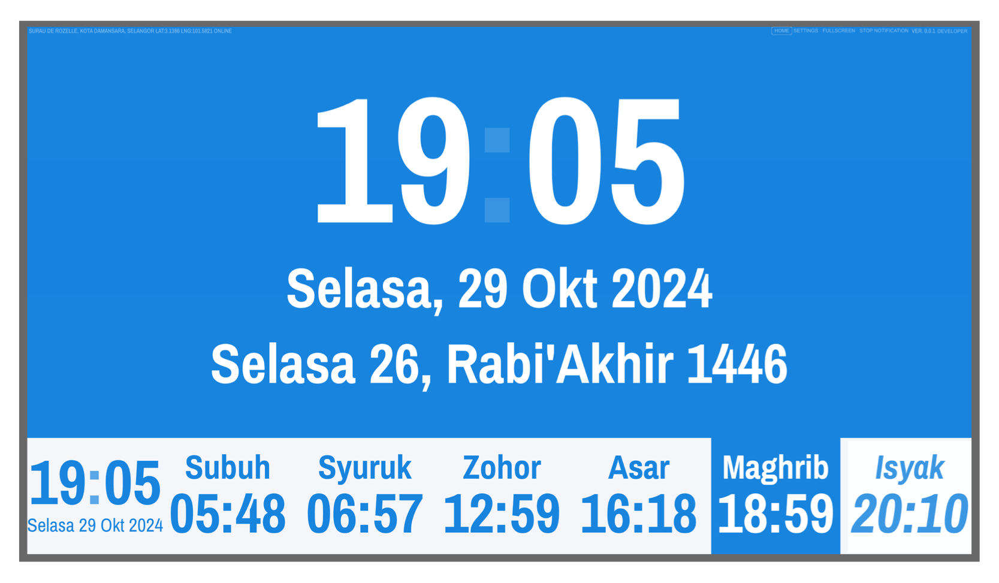

# Muslim Prayer Times

 

A simple web app to display muslim prayer timings and next prayer time and countdown to Iqamah. The app is built with SolidJS and Vite. It is designed to be used on a 27 inch 4K TV that uses computer with an OS with Google Chrome installed.

## Development Status

This project is currently in active development. While core functionality is implemented, some features are still being added and refined. Contributions and feedback are welcome!

## Features

Currently the prayer names (Subuh, Zohor, Asar, Maghrib aand Isyak) are in Bahasa Malaysia.

- Display prayer times.
- Play adhan.
- Display hijri date.
- Display the next prayer time and countdown to Iqamah.
- Display daily Qur'an verse.
- Display daily Hadith randomly from 100 hadiths by Imam Bukhari, Sahih Bukhari (Vol.1).
- Display notice (mosque annoucement).

## Credits

- The prayer timings uses prayertiming npm package by Shahidul Islam Majumder.
- The daily verse from Qur'an is only possible using endpoint from api.alquran.cloud
- The daily hadith is from www.hadithapi.com
